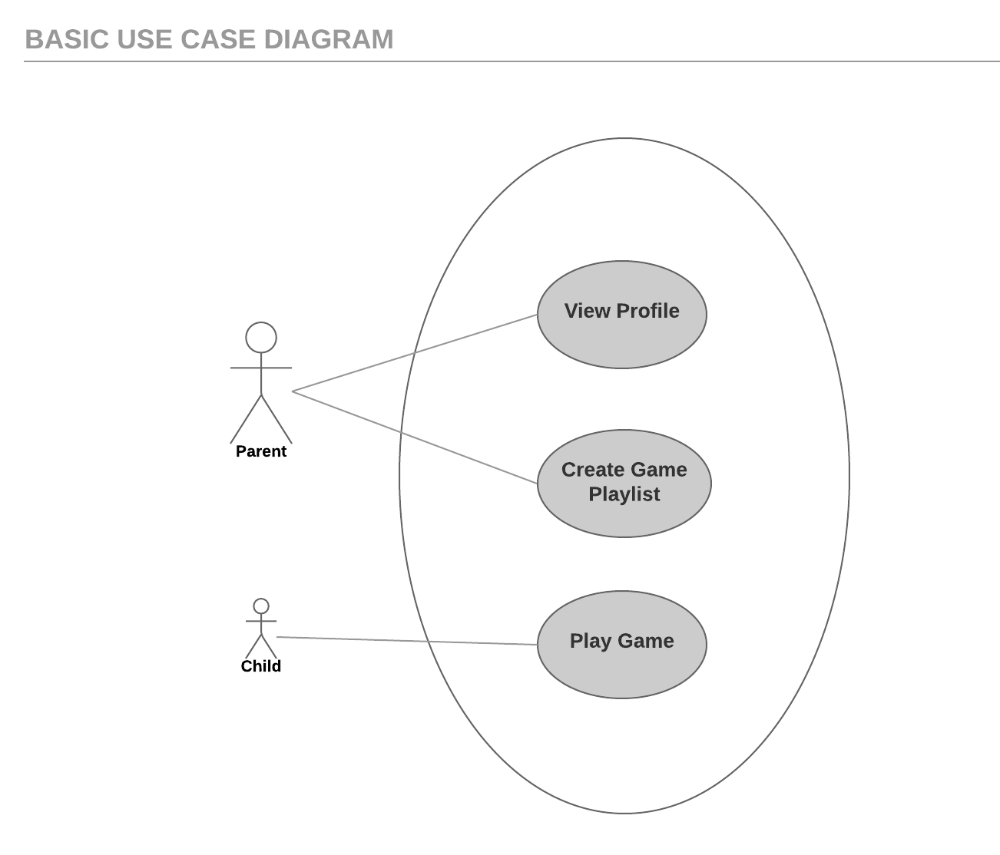
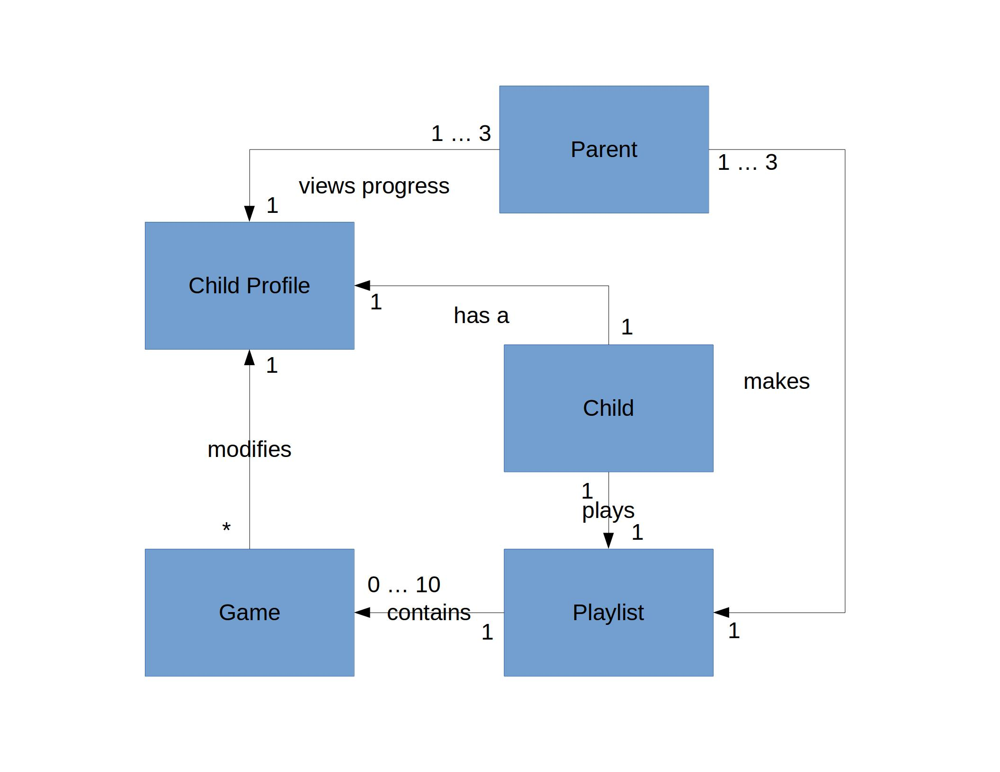

# Requirements #

## End-user Observation ##

Persona:

David T. Woodard has a daughter, Shirley, with a autism spectrum disorder and would like an effective way to teach Shirley 
cognitive empathy without going to therapy sessions.

Shirley has ASD. She is relatively high functioning, but has some trouble recognizing emotions. Her father would like to introduce 
an easy way for her to learn and practice cognitive empathy at home.

## Use Cases ##

Parent can *View Profile*, *Make Game Playlist*  
Child can *Play Game*

Title: View Profile  
User: Parent  
Scenario: Parent views profile that contains analytics and information from the cognitive empathy training games the child has  
played.   

Title: Make Game Playlist  
User: Parent   
Scenario: Parent adds specific games to the game playlist for the child to play. Parent creates a schedule for daily playlists   
that the child should play.   

Title: Play Game  
User: Child  
Scenario: Child sees example faces of an certain emotion. Child has a certain amount of time to recreate the emotion using his/her 
face. Child earns points for completing the task correctly.  

## Domain modeling ##

